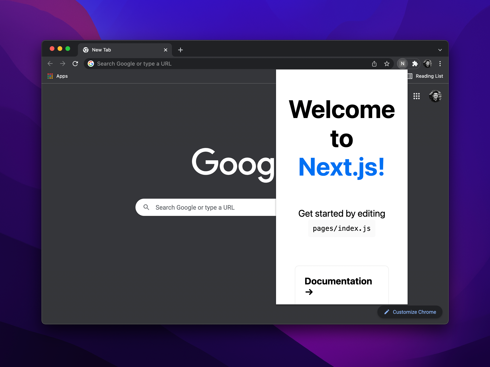

`next-chrome` is a [Next.js](https://nextjs.org/) starter project to bootstrap a new Chrome extension.

```sh
cd next-app

yarn # run once

yarn build # on macOS
yarn build:linux # on Linux
```



[Helpful Tips for Starting a Next.js Chrome Extension | CSS-Tricks](https://css-tricks.com/nextjs-chrome-extension-starter/)
